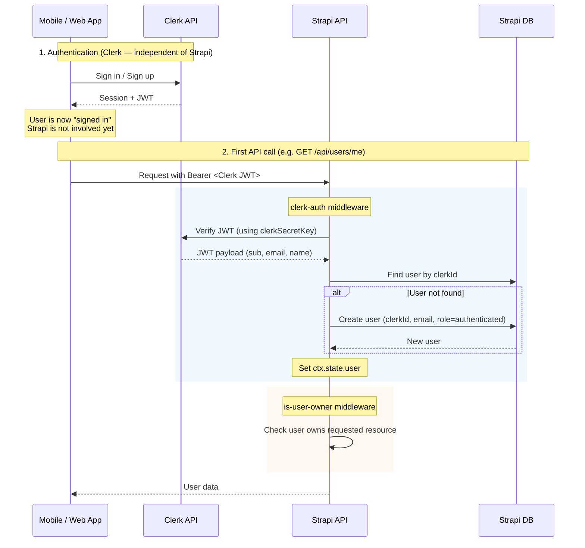
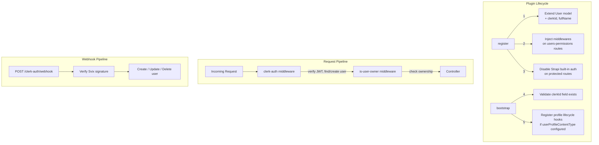

# strapi-plugin-clerk-auth

A Strapi v5 plugin that replaces Strapi's built-in JWT authentication with [Clerk](https://clerk.com). Clerk handles sign-in/sign-up on the client; this plugin verifies Clerk JWTs on the Strapi side, auto-creates users in the `users-permissions` table, and protects user routes with ownership checks.

## How authentication works

In a traditional Strapi setup, Strapi is both the **auth provider** and the **backend** — it issues JWTs via `/api/auth/local` and verifies them on subsequent requests. This plugin changes that:

- **Clerk is the auth provider.** Sign-in/sign-up happens entirely between the client app and Clerk's servers. Clerk issues the JWT. Strapi is never involved in the sign-in flow.
- **Strapi is the backend only.** It receives the Clerk JWT in the `Authorization` header, verifies it using the Clerk secret key, and maps it to a `users-permissions` user.
- **Strapi's built-in JWT auth is disabled** on protected routes (`config.auth = false`). Without this, Strapi would reject the Clerk JWT before the plugin middleware runs.

This means:
- A user can be **signed in** (valid Clerk session) even if Strapi is down. The client app should handle API errors gracefully (e.g. show a retry screen).
- **Strapi roles and permissions still work.** The middleware sets `ctx.state.user` to a real `users-permissions` user, so everything downstream (roles, policies, content ownership) behaves normally.
- **No Strapi JWT is ever issued.** The Clerk JWT is the only token in the system.



## Architecture



## Protected routes

The plugin takes over authentication for these `users-permissions` routes:

| Route | Handler | Middlewares |
|---|---|---|
| `GET /api/users` | `user.find` | `clerk-auth` |
| `GET /api/users/:id` | `user.findOne` | `clerk-auth` + `is-user-owner` |
| `PUT /api/users/:id` | `user.update` | `clerk-auth` + `is-user-owner` |
| `DELETE /api/users/:id` | `user.destroy` | `clerk-auth` + `is-user-owner` |
| `GET /api/users/me` | `user.me` | `clerk-auth` |

Strapi's built-in auth (`config.auth`) is disabled on these routes so the Clerk JWT isn't rejected before the middleware runs.

## Setup guide

### 1. Install dependencies

The plugin requires `@clerk/backend` and `svix` (for webhook verification):

```bash
cd plugin/strapi-plugin-clerk-auth
npm install
npm run build
```

### 2. Register the plugin in your Strapi project

In your Strapi project's `config/plugins.ts`:

```ts
import path from "node:path";

export default () => ({
  "clerk-auth": {
    enabled: true,
    resolve: path.resolve(process.cwd(), "../plugin/strapi-plugin-clerk-auth"),
    config: {
      clerkSecretKey: process.env.CLERK_SECRET_KEY,
      clerkWebhookSecret: process.env.CLERK_WEBHOOK_SECRET, // optional
      userProfileContentType: "api::user-profile.user-profile", // optional
    },
  },
});
```

### 3. Set environment variables

Add to your Strapi project's `.env`:

```env
CLERK_SECRET_KEY=sk_test_...
CLERK_WEBHOOK_SECRET=whsec_...  # optional, from Clerk Dashboard > Webhooks
```

| Variable | Required | Description |
|---|---|---|
| `CLERK_SECRET_KEY` | Yes | Clerk secret key for JWT verification. Found in Clerk Dashboard > API Keys. |
| `CLERK_WEBHOOK_SECRET` | No | Svix signing secret for webhook verification. Required only if using webhooks. |

### 4. Build the plugin

```bash
cd plugin/strapi-plugin-clerk-auth
npm run build
```

Then restart Strapi. On startup you should see:

```
[clerk-auth] Added clerkId and fullName fields to User model
[clerk-auth] Middlewares registered on users-permissions routes
```

### 5. Configure the client

Your client app sends Clerk JWTs as Bearer tokens. Example with a React Native / Expo app:

```ts
const { getToken } = useAuth(); // from @clerk/clerk-expo

const token = await getToken();
const res = await fetch("http://localhost:1337/api/users/me", {
  headers: { Authorization: `Bearer ${token}` },
});
const user = await res.json();
```

On the first request, the plugin auto-creates a Strapi user with the `authenticated` role.

## Plugin config reference

| Option | Type | Default | Description |
|---|---|---|---|
| `clerkSecretKey` | `string` | `""` | **(Required)** Clerk secret key for verifying JWTs. |
| `clerkWebhookSecret` | `string` | `""` | Svix webhook signing secret. If empty, webhook signature verification is skipped. |
| `userProfileContentType` | `string` | `""` | UID of a content type to auto-create as a profile when a user is created (e.g. `api::user-profile.user-profile`). The content type must have a `user` relation and a `name` text field. |

## Webhooks

The plugin exposes `POST /api/clerk-auth/webhook` (no auth required) to receive Clerk webhook events:

| Event | Action |
|---|---|
| `user.created` | Creates a Strapi user if one doesn't exist for the Clerk ID |
| `user.updated` | Updates email, username, and fullName |
| `user.deleted` | Deletes the Strapi user matching the Clerk ID |

To set up webhooks:

1. Go to Clerk Dashboard > Webhooks
2. Add endpoint: `https://your-strapi-domain.com/api/clerk-auth/webhook`
3. Subscribe to `user.created`, `user.updated`, `user.deleted`
4. Copy the signing secret to `CLERK_WEBHOOK_SECRET`

## User model extensions

The plugin adds two fields to `plugin::users-permissions.user` at registration time (no migration needed):

| Field | Type | Description |
|---|---|---|
| `clerkId` | `string` (unique) | The Clerk user ID (`user_xxx`) |
| `fullName` | `string` | Full name derived from Clerk's `first_name` + `last_name` |

## Profile auto-creation

When `userProfileContentType` is configured, the plugin subscribes to database lifecycle hooks:

- **afterCreate**: Creates a profile document linked to the new user. If no `fullName` is available, generates a random username (e.g. "SwiftTiger4821").
- **beforeDelete**: Deletes the associated profile when a user is deleted.

## Development

```bash
# Watch mode (rebuilds on file changes)
npm run watch

# Type check
npm run test:ts:back
```

## License

MIT
